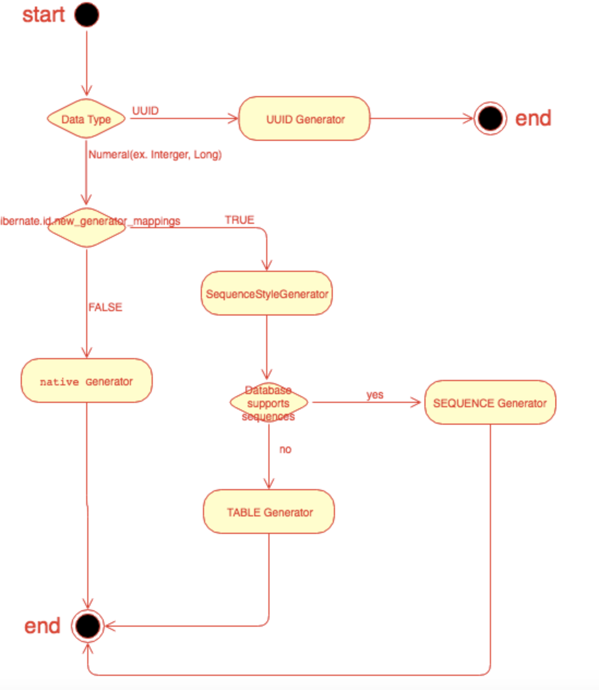

# 엔티티 매핑


## 필드와 컬럼 매핑 : 레퍼런스

필드와 컬럼 매핑
* @Column : 컬럼을 매핑한다.
* @Enumeratrd : 자바의 enum 타입을 매핑한다.
* @Temporal : 날짜 타입을 매핑한다.
* @Lob : BOLB , CLOB 타입을 매핑한다.
* @Transient : 특정 필드를 데이터베이스에 매핑하지 않는다. 객체를 임시로 보관하고 싶을 때 사용

기타
* @Access : jpa가 엔티티에 접근하는 방식을 지정한다.


## @Entity

* 테이블과 매핑할 클래스는 @Entity 어노테이션을 필수로 붙야야한다.
* @Entity가 붙은 클래스는 JPA가 관리하고 엔터티라고 부른다.
* 기본 생성자는 필수다(파라미터가 없는 public , protected 생성자)
* final 클래스 , enum , interface , inner 클래스에는 사용할 수 없다.
* 저장할 필드에 final을 사용하면 안된다.


***`@Entity 속성 정리`***

|속성|기능|기본값|
|----|----|---|
|name|jpa에서 사용할 엔티티 이름을 지정한다.|설정하지 않으면 클래스 이름을 그대로 사용한다.|


## @Table

* @Table은 엔터티와 매핑할 테이블을 지정한다.
* 생략하면 매핑한 엔티티 이름을 테이블 이름으로 사용한다.


### @Column

* 갹체 필드를 테이블 컬럼에 매핑한다.
* 속성중에 name , nullable 이 주로 사용되고 나머지는 잘 사용하지 않는다.
* insertable , updatable 속성은 데이터베이스에 저장되어 있는 정보를 읽기만 하고 실수로 변경하는 것을 방지하고 싶을 때 사용한다.


### @Enumeratrd

|속성|기능|기본값|
|----|----|---|
|value|EnumType.ORDINAL enum 순서를 데이터베이스에 저장<br> ,EnumType.String enum 이름를 데이터베이스에 저장 , |EnumType.ORDINAL|


`EnumType.ORDINAL VS EnumType.String`

* EnumType.ORDINAL은 enum에 정의된 순서대로 ADMIN은 0 , USER는 1 값이 데인터베이스에 저장된다.<br>
>> 장점 : 데이터베이스에 저장되는 데이터 크기가 작다.
>> 단점 : 이미 저장된 enum의 순서를 변경할 수 없다.

* EnumType.String은 이름 그대로 admin , user 문자 그대로 데이터베이스에 저장한다.<br>
>> 장점 : 저장된 enum의 순서가 바뀌거나 enum이 추가되어도 안전하다.
>> 단점 : 데이터베이스에 저장되는 데이터 크기가 ORDINAL에 비해서 크다.


### @Temporal

|속성|기능|기본값|
|----|----|---|
|value|temporalType.DATE  <br>,temporalType.TIME <br>, temporalType.TIMESTAMP |temporalType는 필수로 지정해야 한다.|

>> temporalType.DATE : 날짜 , 데이터베이스 date 타입과 매핑 ex). 2020-01-01 
>> temporalType.TIME : 시간, 데이터베이스 time 타입과 매핑 ex). 11:11:11
>> temporalType.TIMESTAMP : 날짜,시간 데이터베이스 timestamp 타입과 매핑 ex). 11:11:11


### @Lob

* 매핑하는 필드 타입이 문자면 CLOB , 나머지는 BLOB으로 매핑

>> CLOB : String ,char[] , java.sql.COLB
>> BLOB : byte[] , java.sql.BLOB


## 다양한 매핑 사용

`요구사항`

1. 회원은 일반 회원과 관리자로 구분해야 한다.
2. 회원 가입일과 수정일이 있어야 한다.
3. 회원을 설명할 수 있는 필드가 있어야 한다. 이 필드는 길이 제한이 없다.


``` java

  @Entity
  @Table(name="MEMBER", uniqueConstraints = {@UniqueConstraint( //추가 //**
          name = "NAME_AGE_UNIQUE",
          columnNames = {"NAME", "AGE"} )})
  public class Member {
  
      @Id
      @Column(name = "ID")
      private String id;
  
      @Column(name = "NAME", nullable = false, length = 10)
      private String username;
  
      private Integer age;
  
      //=== 추가
      @Enumerated(EnumType.STRING)
      private RoleType roleType;
  
      @Temporal(TemporalType.TIMESTAMP)
      private Date createdDate;
  
      @Temporal(TemporalType.TIMESTAMP)
      private Date lastModifiedDate;
  
      @Lob
      private String description;
  
      @Transient
      private String temp;
    }

```

``` java

  public enum RoleType {
      ADMIN, USER
  }


```


## 데이터베이스 스키마 자동 생성

`<property name="hibernate.hbm2ddl.auto" value="create" />`

애플리케이션 실행 시점에 데이터베이스 테이블을 자동으로 생성한다.

`<property name="hibernate.show_sql" value="true" />`

테이블 생성 DDL을 출력해준다.


***`hibernate.hbm2ddl.auto 속성`***

|옵션|설명|
|---|---|
|create	|기존 테이블을 삭제하고 새로 생성한다. DROP + CREATE|
|create-drop|create 속성에 추가로 애플리케이션을 종료할 때 생성한 DDL을 제거한다. DROP + CREATE + DROP|
|update	|데이터베이스 테이블과 엔티티 매핑정보를 비교해서 변경 사항만 수정한다.|
|validate|데이터베이스 테이블과 엔티티 매핑정보를 비교해서 차이가 있으면 경고를 남기고 애플리케이션을 실행하지 않는다. 이설정은 DDL을 수정하지 않는다.|


## DDL 생성 기능

* 회원 이름은 필수
>> nullable = false
* 10자를 초과하면 안되는 제약조건
>> length = 10


``` java

  @Column(name = "NAME", nullable = false, length = 10)
  private String username;


```


* 유니크 제약조건
>> UniqueConstraint 속성

``` java

  @Entity
  @Table(name="MEMBER", uniqueConstraints = {@UniqueConstraint( //추가 //**
          name = "NAME_AGE_UNIQUE",
          columnNames = {"NAME", "AGE"} )})
  public class Member {
  
      @Id
      @Column(name = "ID")
      private String id;
  
      @Column(name = "NAME", nullable = false, length = 10)
      private String username;
  
      private Integer age;
      
      ....
      
      }


```

>> 위와 같은 기능들은 단지 DDL을 자동 생성할 때만 사용되고 JPA의 실행 로직에는 영향을 주지않는다.<br>
따라서 스키마 자동생성 기능을 사용하지 않고 직접 DDL을 만든다면 사용할 이유가 없다.


## 기본 키 매핑


``` java

    @Id
    @Column(name = "ID")
    private String id;


```

`직접 할당 방식: 기본 키를 애플리케이션에서 직접 할당한다.`

``` java

    String id = "id5";
    Member member = new Member();
    member.setId(id);

```


`자동 생성 방식: 대리 키 사용 방식 , 데이터베이스가 생성해주는 값을 사용`

>> 식별자가 생성되는 경우에는 **@GeneratedValue** 어노테이션을 사용하고 식별자 생성 전략을 선택해야 한다.

### IDENTITY : 기본 키 생성을 데이터베이스에 위임한다.

데이터배이스에 값을 저장하고 나서야 기본 키 값을 구할 수 있을 때 사용한다.<br>


``` java

    @Entity
    public class IdentityBoard {
        @Id
        @GeneratedValue(strategy = GenerationType.IDENTITY)
        private Long id;
        
    }

```

``` java

    public static void logic(EntityManager em) {
    
            Member member = new Member();
            em.persist(member);
            System.out.println(member.getId(););
    }

```


### SEQUENCE : 데이터베이스 시퀀스를 사용해서 기본 키를 할당한다.

    
``` java

    @Entity
    public class SequenceBoard {
        
        @Id
        @SequenceGenerator(name="BOARD_SEQ_GENERATOR", sequenceName = "BOARD_SEQ",initialValue = 1,allocationSize = 1)
        @GeneratedValue(strategy = GenerationType.SEQUENCE , generator = "BOARD_SEQ_GENERATOR")
        private Long id;
    }

```

***`@SequenceGenerator  하이버네이트 기준`***

|속성|기능|기본값|
|----|----|---|
|name|식별자 생성기 이름|필수|
|sequenceName| 데이터베이스에 등록되어 있는 시퀀스 이름|hibernate_sequence|
|initialValue|DDL 생성시에만 사용됨. 처음 시작하는 수를 지정한다.|1|
|allocationSize|시퀀스 한 번 호출에 사용하는 수 |50|


* allocationSize 사용시 주의점<br>
https://dololak.tistory.com/479

``` java

    public static void logic(EntityManager em) {
    
            Member member = new Member();
            em.persist(member);
            System.out.println(member.getId(););
    }

```

`IDENTITY 과 SEQUENCE 내부 동작 차이`
엔티티를 데이터베이스에 저장 -> 식별자를 조회해서 엔티티의 식별자에게 할당

데이터베이스 시퀀스를 사용해서 식별자를 조회 -> 조회한 식별자를 엔티티에 할당 -> 엔티티를 영속성 컨텍스트에 저장
-> 트랜잭션을 커밋하여 플러시가 일어나면 데이터베이스에 저장


### TABLE : 키 생성 테이블을 생성한다.

키 생성 전용 테이블을 하나 만들고 여기에 이름과 값으로 사용할 칼럼을 만들어 데이터베이스 시퀀스를 흉내내는 전략


``` java

    @Entity
    @TableGenerator(name ="BOARD_SEQ_GENERATOR",table="MY_SEQUENCE",pkColumnName = "BOARD_SEQ",allocationSize = 1)
    public class Board {
    
        @Id
        @GeneratedValue(strategy = GenerationType.TABLE , generator = "BOARD_SEQ_GENERATOR")
        private Long id;
    }

```

``` java

    public static void logic(EntityManager em) {
    
            Board board = new Board();
            em.persist(board);
            System.out.println(board.getId());
    }

```


***`@TableGenerator 하이버네이트 기준`***

|속성|기능|기본값|
|----|----|---|
|name|식별자 생성기 이름|필수|
|table|키생성 테이블|hibernate_sequence|
|pkColumnName| 시퀀스 컬럼명|sequence_name|
|valueColumnName|시퀀스 값 컬럼명|next_val|
|pkColumnValue|키로 사용할 값 이름|엔티티 이름|
|initialValue|DDL 생성시에만 사용됨. 처음 시작하는 수를 지정한다.|1|
|allocationSize|시퀀스 한 번 호출에 사용하는 수 |50|


### AUTO

* 선택한 데이터베이스 방언에 따라 IDENTITY , SEQUENCE , TABLE 전략을 자동 선택
* @GeneratedValue의 기본값

하이버네이트가 자동 키 생성 전략을 어떤과정으로 결정하는가?<br>
https://www.popit.kr/%ED%95%98%EC%9D%B4%EB%B2%84%EB%84%A4%EC%9D%B4%ED%8A%B8%EB%8A%94-%EC%96%B4%EB%96%BB%EA%B2%8C-%EC%9E%90%EB%8F%99-%ED%82%A4-%EC%83%9D%EC%84%B1-%EC%A0%84%EB%9E%B5%EC%9D%84-%EA%B2%B0%EC%A0%95%ED%95%98/




1. @GeneratedValue가 사용된 데이터 타입이 UUID(범용 고유 식별자)인가?
2. hibernate.id.new_generator_mappings에 값이 무엇인가?
3. false이면 하이버네이트에 설정된 데이터베이스에 따라 결정 , true이면 SequencdStyleGenerator를 사용
4. 데이터베이스가 시퀀스를 지원하는가? 
5. 시퀀스를 지원한다면 Sequence Generator , 지원하지 않는다면 Table Generator


