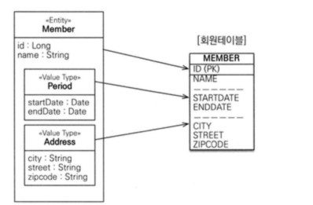
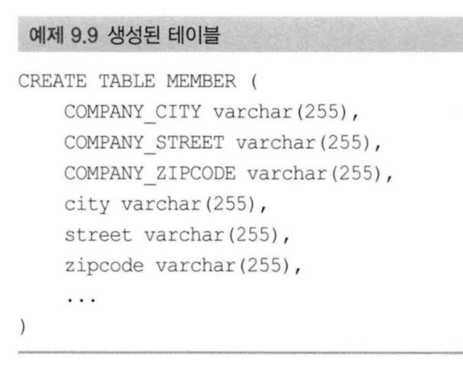
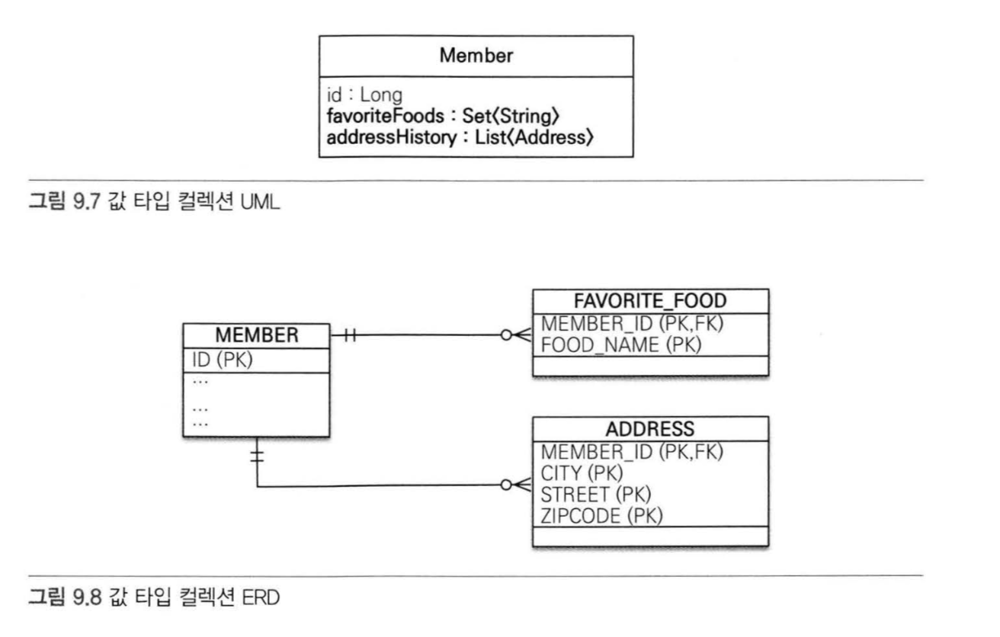

# 값 타입


### JPA 데이터 타입 분류
>> 엔터티 타입 :
* @Entity로 정의하는 객체
* 데이터가 변해도 식별자로 지속해서 추적가능

>> 값 타입 :
* int, Integer, String 처럼 단순히 값으로 사용하는 자바 기본 타입이나 객체
* 식별자가 없고 값만 있으므로 변경시 추적 불가


### 값 타입 분류
1. 기본 값 타입<br>

- `String, int, Integer ...`<br>

- `생명주기를 엔티티에 의존한다.`<br>
회원을 삭제하면 이름, 나이 필드도 함께 삭제된다.<br>

- `값 타입은 공유하면 안된다.`<br>
회원 이름 변경 시 다른 회원의 이름도 함께 변경되면 안된다.<br>
그렇기 때문에 자바의 기본 타입은 항상 값을 복사하는 특징이 있다.<br>
래퍼 클래스는 기본 타입이 아니지만 특수한 케이스로 변경할 수 없다.<br>

2. 임베디드 타입 (복합 값 타입)
- 새로운 값 타입을 직접 정의할 수 있다.
- 주로 기본 값 타입을 모아서 복합 값 타입이라고도 한다.
- int, String과 같은 값 타입의 일종이다.<br>
즉, 공유되면 안된다.


#### 임베디드 타입의 사용법
- @Embeddable : 값 타입을 정의하는 곳에 표시
- @Embedded : 값 타입을 사용하는 곳에 표시


>> 임베디드 값 타입을 적용하기 전

``` java

  @Entity
  class Member{
      @Id
      private Long id;
  
      // 근무기간  
      @Temporal(TemporalType.DATE)
      private Date startDate;
      @Temporal(TemporalType.DATE)
      private Date endDate;
  
      // 집주소  
      private String city;
      private String street;
      private String zipCode;
  }

```

>>  임베디드 값 타입을 적용


``` java

  @Entity
  class Member{
      @Id
      private Long id;
  
      @Embedded
      private Period workPeriod;
  
      @Embedded
      private Address homeAddress;
  }
  
  @Embeddable
  class Period{
      @Temporal(TemporalType.DATE)
      private Date startDate;
      @Temporal(TemporalType.DATE)
      private Date endDate;
  
      public boolean isWork(Date date){
          // 값 타입을 위한 메서드 또한 작성 가능  
      }
  }
  
  @Embeddable
  class Address{
      @Column(name = "city") // 매핑할 컬럼 지정 가능  
      private String city;
      private String street;
      private String zipcode;
  }

```

>> 암베디드 타입과 테이블 매핑




* ORM을 사용함으로써 객체와 테이블을 더 세밀하게 매핑할 수 있음


`속성 재정의 : @AttributeOverride`


``` java

  class Member{
      // ... 
      @Embedded
      private Address homeAddress;
  
      @Embedded
      private Address companyAddress;
  }

```

>>  @AttributeOverride을 이용한 칼럼명 재정의 

``` java

  class Member{
      // ... 
      @Embedded
      private Address homeAddress;
  
      @Embedded
      @AttributeOverrides({
          @AttributeOverride(name = "city", column = @Column(name = "company_city")),
          @AttributeOverride(name = "street", column = @Column(name = "company_street")),
          @AttributeOverride(name = "zipcode", column = @Column(name = "company_zipcode"))
      })
      private Address companyAddress;
  }

```

>> 생성된 테이블





3.  컬렉션 값 타입

Basic Type , Embeddable 값 타입을 하나 이상 저장하려면 `@ElenetCollection`, `@CollectionTable` 을 사용한다.


``` java

  @Entity
  public class Member {
  
      @Id @GeneratedValue
      private Long id;
  
  
      @Embedded
      private Address homeAddress;
  
      @ElenetCollection
      @CollectionTable(name = "FAVORIES_FOODS" , joinColums = @JoinColumn(name = "MEMBER_ID"))
      @Column(name="FOOD_NAME")
      private Set<String> favoriteFoods = new HashSet<>;
      
      @ElenetCollection
      @CollectionTable(name = "ADDRESS" , joinColums = @JoinColumn(name = "MEMBER_ID"))
      private List<Address> addressHisttory = new ArrayList<>;
  
  
  }
  
  
    @Embeddable
    class Address{
    
        @Column(name = "city")
        private String city;
        private String street;
        private String zipcode;
    }

```




